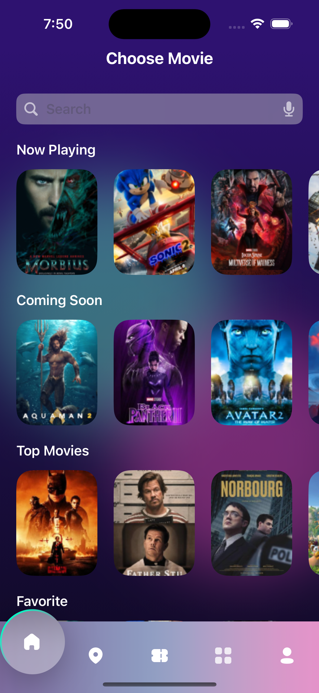
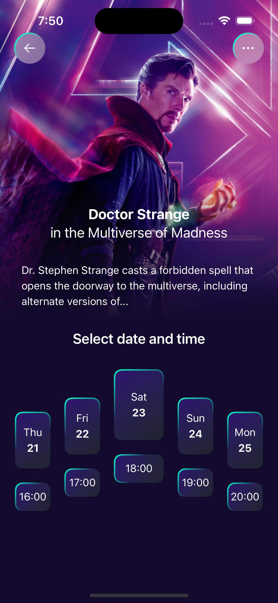
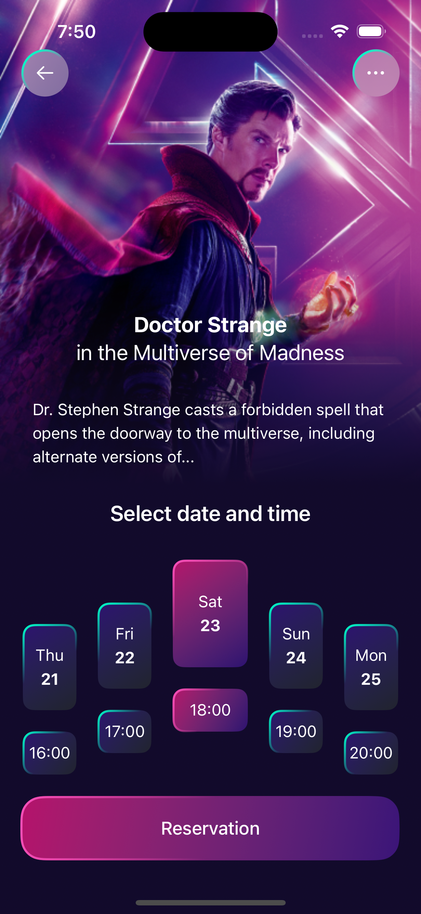
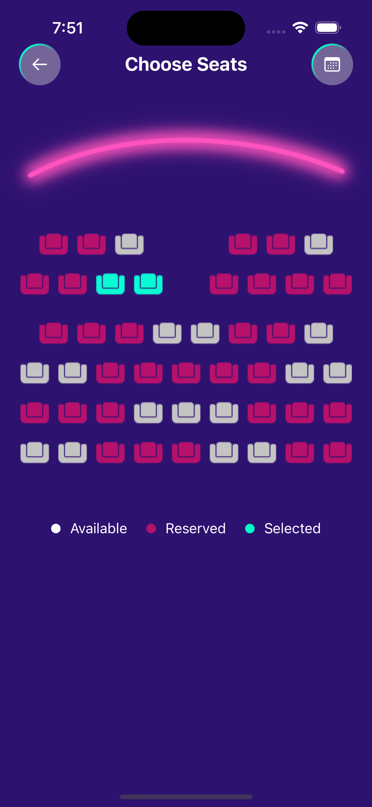
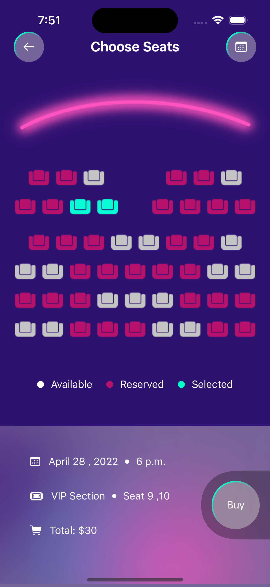
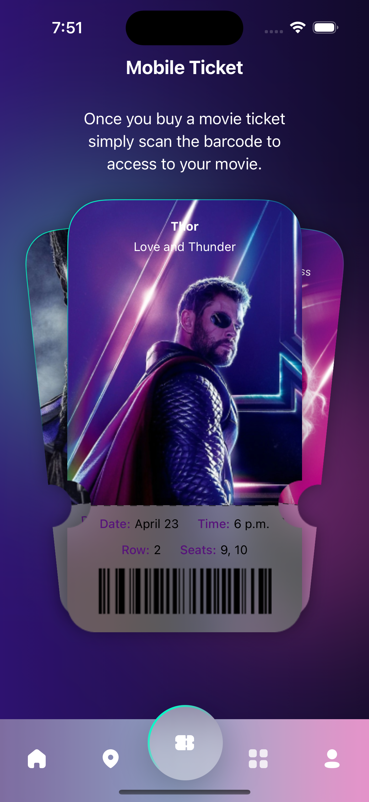

# Ticket

A Movie booking app, made for iOS Devices.

## Screenshots

 | |
---------------------------|---------------------------|-------------------------
 | |

## Installation

Open the project from `.xcodeproj` file

## Technical Stack:

**SwiftUI**: Leverage reactive programming for responsive and fluid UI interactions.

**MVVM Pattern**: Separate business logic from presentation for clearer code and easier testing yet this app mainly focus on the using of SwiftUI and Animation and custom views.

## License

[MIT](https://choosealicense.com/licenses/mit/)

